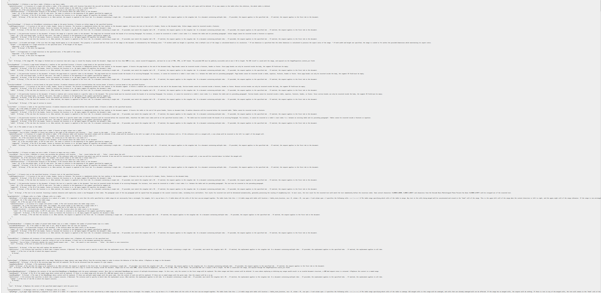

# The Lore of Zenith Tower, As Seen in TETR.IO’s Quick Play 2 “Zenith Tower”
“A hidden underground entrance to the Zenith Hotel. Upon your first steps into the hall, your head feels lighter. Have I been here before?”[^1]
## This Github organization mirrors the [main document](https://docs.google.com/document/d/1KblUkxolAmNQ71kI_Q6V7p0IpuwjGJ8UpyNjs9zL4gk/edit), you can see the repository [here](https://github.com/zenith-tower-lore/lore)
because I am NOT working with google docs api. 
###### (Note: you are welcome to contribute!)
#### (Organization PFP by [Lauren Sheng](https://laurensheng.myportfolio.com/)!!)

[^1]: https://garbo.gg/tetr-io/the-inspirations-behind-qp2/
